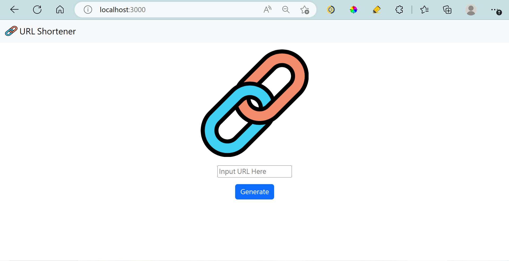
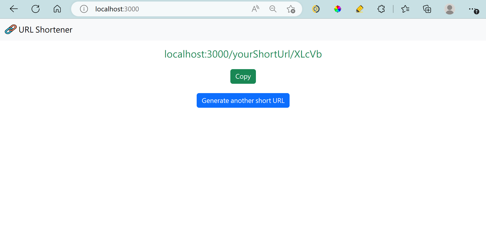

# 短網址生產器

## 簡介

- 將過長的網址縮短，可以透過生成的短網址訪問原網址。

## 網站畫面

- 首頁

- 短網址生成頁

## 其他功能

- 短網址生成後，可以按下copy複製。

## 開發工具

- Node.js 18.12.1
- Express 4.18.2
- Express-Handlebars 6.0.7
- mongoose 6.10.0
- dotenv 16.0.3
- Bootstrap 5.3.0

## 如何安裝使用

1. 請先確保本地端有安裝Node.js及npm。
2. 將本專案下載至本地存放。
3. 請使用終端機，並移至存放本專案的位置。

> cd 存放本專案的位置

4. 輸入以下內容，安裝與本專案相關的套件：

> npm install

5. 待上一步安裝完成後，再輸入：

> npm run start

6. 待上一步完成後，終端機會提示如下，請將後方網址複製到瀏覽器上進行瀏覽。

> Generate-Short-URL server is running on <http://localhost:3000>

7. 如果想暫停使用，請在終端機輸入ctrl^c，並關閉瀏覽器即可。
